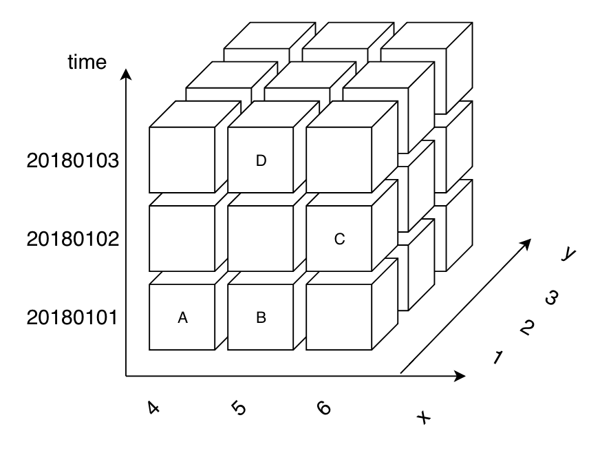

# cubus

> cubus means cube in Latin.

## Install

```bash
npm i cubus
```

## Usage

suppose you want to build a cube...



### Build?

```javascript
import Cubus from 'cubus'

const dimensions = [
  'time',
  'x',
  'y'
]

// new a cube with that three dimensions
const cube = new Cubus(dimensions)

// and add whatever value to dimensions
cube.addDimensionValue('time', '20180101')
cube.addDimensionValue('time', '20180102')
cube.addDimensionValue('time', '20180103')

cube.addDimensionValue('x', '4')
cube.addDimensionValue('x', '5')
cube.addDimensionValue('x', '6')

cube.addDimensionValue('y', '1')

// add datum to the cube
cube.add('A', {
  time: '20180101',
  x: '4',
  y: '1'
})

// why not chain it up?
cube
.add('B', {
  time: '20180101',
  x: '5',
  y: '1'
})
.add('C', {
  time: '20180102',
  x: '6',
  y: '1'
})
.add('D', {
  time: '20180103',
  x: '5',
  y: '1'
})
```

### Query?

```javascript
cube.query({
  time: ['20180101', '20180102']
})
// will give you value and property
//
// [
//   {
//     "value": "A",
//     "property": [
//       {
//         "name": "time",
//         "value": "20180101"
//       },
//       {
//         "name": "x",
//         "value": "4"
//       },
//       {
//         "name": "y",
//         "value": "1"
//       }
//     ]
//   },
//   {
//     "value": "B",
//     "property": [
//       {
//         "name": "time",
//         "value": "20180101"
//       },
//       {
//         "name": "x",
//         "value": "5"
//       },
//       {
//         "name": "y",
//         "value": "1"
//       }
//     ]
//   },
//   {
//     "value": "C",
//     "property": [
//       {
//         "name": "time",
//         "value": "20180102"
//       },
//       {
//         "name": "x",
//         "value": "6"
//       },
//       {
//         "name": "y",
//         "value": "1"
//       }
//     ]
//   }
// ]

 // true means yes, give me raw data
cube.query({
  time: ['20180101', '20180102']
}, true)
// give you
//
// [
//   "A",
//   "B",
//   "C"
// ]

// multiple conditions
cube.query({
  time: ['20180101', '20180102'],
  x: ['6']
}, true)
// give you
// [
//   "C"
// ]
```

### Remove?

```javascript
// just claim the conditions
cube.remove({
  appid: ['20180101']
})
```

### well I need to remove one by one?

```javascript
// CLEAR backs you up
cube.clear()
```

### export and import?

```javascript
// in case you want to transport data to somewhere via http or whatever
const json = cube.toJSON()

anotherCube.fromJSON(json)
```

## API

to be filled

## License

MIT